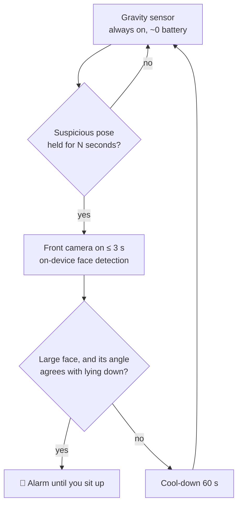
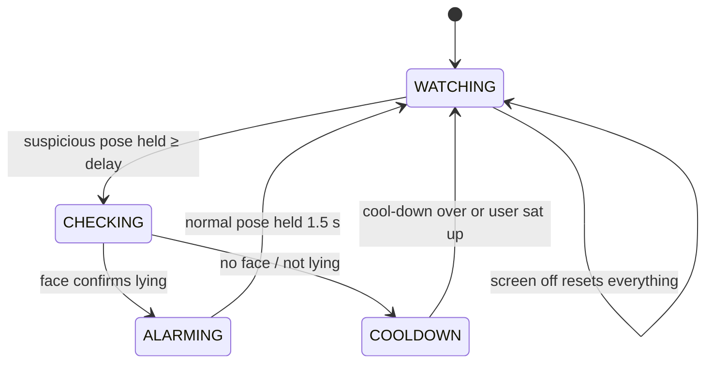

# 🌙 Rebahan Guard

**An Android app that rings an alarm when you use your phone while lying in bed.**

*Rebahan* is Indonesian for "lying around". Scrolling while lying down quietly eats into sleep, so this app catches it with **sensor fusion**: a cheap gravity sensor watches all the time, and the front camera only switches on for a few seconds to confirm.


---

## Why this is harder than it sounds

A phone has no "bed sensor". GPS can't help either: indoors it is off by 5–20 m, and even a perfect fix can't tell *on the bed* from *on the desk next to it*. So the app answers a different, measurable question:

> **Is the user's head horizontal while the screen is in use?**

## How it works



This **cascade** (cheap detector first, expensive one only on suspicion) is the same idea behind "Hey Google" wake-word chips.

### Step 1 — Phone orientation from gravity

The accelerometer always feels gravity. Normalising the vector `(x, y, z)` tells us which phone axis points at the floor:

| What you're doing | Phone pose | Gravity share |
|---|---|---|
| Sitting, normal use | `UPRIGHT` | mostly **y** |
| On your back, phone overhead | `FACE_DOWN` | **z < −0.5** (screen faces the floor) |
| On your side | `SIDEWAYS` | mostly **x** |

### Step 2 — Head orientation = phone orientation + face roll

`SIDEWAYS` alone is ambiguous: watching a landscape video while sitting also turns the phone sideways. ML Kit reports the face's **roll** inside the camera frame, and combining both gives the orientation of the *head*:

| Phone (gravity) | Face in image | Conclusion |
|---|---|---|
| Sideways | upright (roll ≈ 0°) | head is sideways too → **lying on side** 🔔 |
| Sideways | rotated (roll ≈ ±90°) | head is upright → sitting, watching video ✅ |
| Face down | any large face | user is under the phone → **lying on back** 🔔 |

A minimum face size (20 % of the image width) means a roommate across the room is ignored.

### Step 3 — A testable state machine



All decisions live in pure Kotlin (`core/`, zero Android imports), so they are covered by fast JVM unit tests with fake timestamps.

## Architecture

```
app/src/main/java/io/github/wisnujayaa/rebahanguard/
├── core/                 # Pure logic, unit-tested
│   ├── Pose.kt           #   gravity vector → Pose
│   ├── Debouncer.kt      #   "true for N ms" filter
│   ├── LyingJudge.kt     #   sensor fusion: pose + face → lying?
│   └── GuardEngine.kt    #   state machine, emits Actions
├── service/              # Android glue
│   ├── GuardService.kt   #   foreground service (type=camera), sensors, screen on/off
│   ├── FaceChecker.kt    #   CameraX ImageAnalysis + ML Kit face detection
│   ├── AlarmPlayer.kt    #   looping alarm sound + vibration
│   └── GuardStatusStore.kt # StateFlow shared with the UI
├── ui/Theme.kt           # Material 3, dynamic color
└── MainActivity.kt       # Jetpack Compose screen
```

The engine never touches hardware: it returns an `Action` (`START_CAMERA_CHECK`, `START_ALARM`, …) and the service performs it. This keeps the logic testable and the Android layer thin.

## Privacy

- Face detection runs **entirely on the device**, using ML Kit's model hosted in Google Play services. The manifest explicitly **removes the `INTERNET` permission** that ML Kit's telemetry library would add, so this app has no network access and camera frames cannot be sent anywhere.
- The *unbundled* model was chosen on purpose: the bundled variant ships native libraries that have been [reported](https://github.com/googlesamples/mlkit/issues/1024) to fail on newer devices that use 16 KB memory pages.
- Frames are analysed in memory and dropped immediately; nothing is saved.
- The camera is used for at most ~3 s per check, and Android's green camera indicator shows every time.

## Android platform constraints (and how they're handled)

| Constraint | Handling |
|---|---|
| Camera is a *while-in-use* permission: a camera foreground service can't be **started** from the background (Android 12+/14+) | Guard is started from the visible app; service declared `foregroundServiceType="camera"` |
| A system restart of the service would happen from the background and fail | `START_NOT_STICKY`; user re-enables from the app |
| Background apps don't receive continuous sensor events | Foreground service keeps sensor access |
| Battery | Sensors unregister when the screen turns off; camera only on suspicion; 60 s cool-down |

## Known limitations / roadmap

- [ ] Lying on your stomach (phone face-up) is not detected yet — idea: proximity sensor + pitch angle
- [ ] Very dark rooms can make face detection fail (screen light usually helps)
- [ ] Some OEM battery savers (Xiaomi, Oppo, vivo) may kill the service — whitelist the app
- [ ] Schedule (only active at night), statistics of "caught" events
- [ ] Instrumented tests for `FaceChecker`

## Build & install

**No Android Studio needed.** Every push to `main` runs GitHub Actions, which runs the unit tests and builds the APK:

1. Open the **Actions** tab → latest *Build APK* run → download **RebahanGuard-apk**.
2. Unzip, copy the `.apk` to your phone, open it, allow "Install unknown apps".
3. Open the app → set the delay → **Aktifkan penjaga** → grant camera + notifications.

Local build (needs JDK 17 + Android SDK):

```bash
./gradlew testDebugUnitTest   # pure-logic unit tests
./gradlew assembleDebug       # → app/build/outputs/apk/debug/app-debug.apk
```

> `keystore/debug.keystore` is a public debug key (password `android`) committed on purpose so that every CI build installs as an update. It must never be used for a store release.

## Tech stack

Kotlin · Jetpack Compose (Material 3) · CameraX · Google ML Kit Face Detection · Android Sensor framework · Foreground services · StateFlow · JUnit · GitHub Actions

## License

MIT — see [LICENSE](LICENSE).
