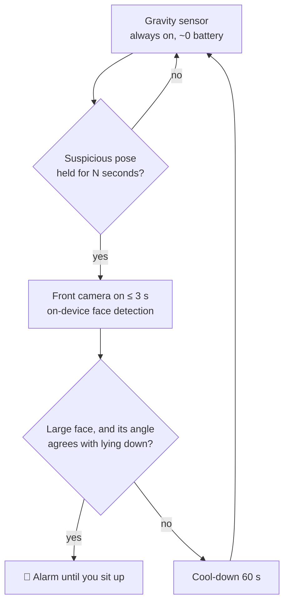
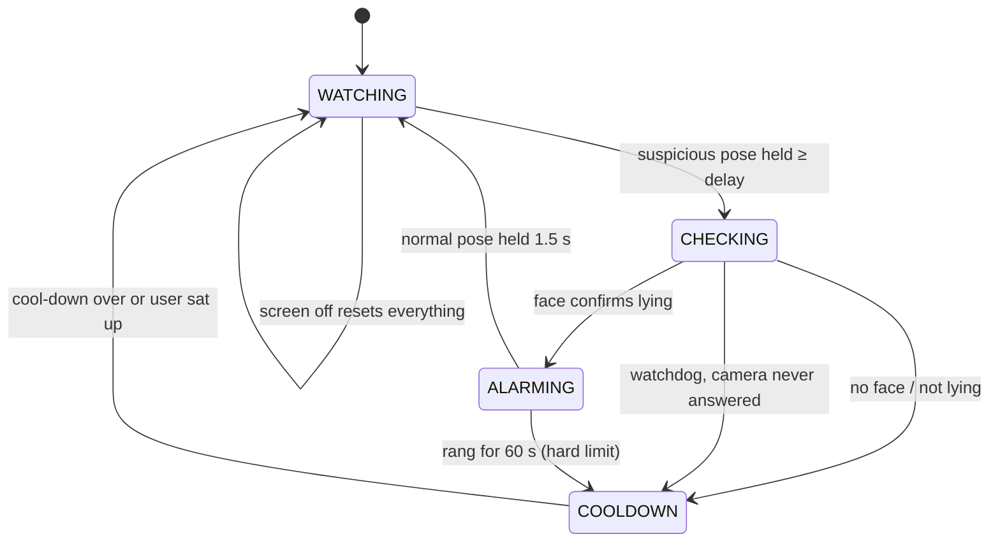

# Rebahan Guard

**An Android app that locks your phone when you use it lying in bed while there is work to do.**

*Rebahan* is Indonesian for "lying around". Scrolling in bed quietly eats the hours meant for
studying, assignments and personal goals. The app catches it with **sensor fusion** (a cheap
gravity sensor watches all the time, the front camera switches on for a few seconds to
confirm) and answers with a lock screen that names **what you are leaving behind**: "you're lying
down, but *Laporan praktikum DDP2* is due in 4 h 12 m".

[](https://github.com/wisnujayaa-labs/rebahan-guard/actions/workflows/build.yml)


---

## Why this is harder than it sounds

A phone has no "bed sensor". GPS can't help either: indoors it is off by 5–20 m, and even a perfect fix can't tell *on the bed* from *on the desk next to it*. So the app answers a different, measurable question:

> **Is the user's head horizontal while the screen is in use?**

## How it works



This **cascade** (cheap detector first, expensive one only on suspicion) is the same idea behind "Hey Google" wake-word chips.

### Step 1 — Are you looking down at the phone, or up at it?

The accelerometer always feels gravity, so the app knows the **screen elevation**: the angle the screen faces, from +90° (ceiling) to −90° (floor).

The key observation came from real-world testing: **sitting, you look *down* at your phone, so the screen faces up. Lying in bed (flat *or* propped up on a pillow, phone held upright), you look straight at it or *up* at it, so the screen faces sideways or down.**

| What you're doing | Screen elevation | Pose |
|---|---|---|
| Sitting, normal use | about +20° … +60° | `UPRIGHT` / `TILTED` |
| Propped on a pillow, phone upright | about −5° … −30° | `FACE_DOWN` (suspicious) |
| Flat on your back, phone overhead | about −60° … −90° | `FACE_DOWN` (suspicious) |
| On your side | phone's long edge points down | `SIDEWAYS` (suspicious) |

The threshold (default −5°) can be **calibrated**: the app records 5 s of sitting and 5 s of lying and picks the angle that best separates the two. This is a tiny one-feature classifier, made robust to stray samples by using percentiles instead of min/max.

### Step 2 — Head orientation = phone orientation + face roll

Gravity alone can't separate every case (e.g. lying on your side with the phone upright, or sitting while watching a landscape video). The camera reports the face's **roll** inside the image, and combining it with the phone's rotation gives the tilt of the *head* relative to Earth:

| Phone (gravity) | Face in image | Head | Verdict |
|---|---|---|---|
| Sideways | upright | sideways | **lying on side** 🔔 |
| Sideways | rotated 90° | upright | sitting, landscape video ✅ |
| Upright *(strict mode)* | rotated 90° | sideways | **lying on side** 🔔 |
| Upright | upright | upright | sitting ✅ |
| Screen facing down | any large face | — | **looking up from below** 🔔 |

The math uses only absolute angles, so it doesn't depend on sign conventions (front-camera mirroring, ML Kit's roll direction). Diagonal holds (≈45°), where the two readings become ambiguous, are deliberately left undecided (fail-safe). A minimum face size (20 % of the image width) means a roommate across the room is ignored.

**Strict mode** (optional) also checks with the camera while the phone is upright. Since sitting up doesn't change an upright phone's pose, alarms in this mode ring in 5-second bursts with a camera re-check in between, and stop as soon as the head is upright again.

### Step 2½ — When the camera can't see you

Real-world testing showed the camera often fails exactly when it matters (dark room, face half
in a pillow, phone too close). Treating "no face" as "not lying" made that the biggest loophole,
so the decision now weighs **how strong the gravity evidence is**:

| Gravity evidence | Camera sees a lying head | Camera sees nothing usable |
|---|---|---|
| **Strong**: screen clearly facing the floor (< −30°) | 🔒 lock | 🔒 lock anyway (nobody uses a phone like that sitting up) |
| **Medium**: slightly tilted, or sideways | 🔒 lock | 🔁 re-check every ~20 s; still suspicious after 2 min → 🔒 lock |
| **Weak**: upright (strict mode only) | 🔒 lock | ✅ no lock |

A visible, upright head always wins ("sitting"). The camera side was improved too: ML Kit
`ACCURATE` mode, smaller minimum face, a 6-second window, and a **ring light**: if the first
frames are dark, the screen briefly turns full-brightness white to light the user's face. Every
check records *why* it ended (too dark, no face, face too small, model not ready…) so problems are
measured, not guessed.

### Plan: urgent ≠ important

The **Rencana** tab splits work the way the Eisenhower matrix does: *urgent* (a deadline within
24 h — the clock forces it), *important but not urgent* (nothing forces it, so it is the first
thing traded for lying in bed) and *later*. The nearest deadline is what the lock screen talks
about. Stored in app-private storage through `AtomicFile` (a crash mid-write keeps the previous
version), with a versioned, fuzz-tested text codec.

### Dreams → habits → proof

The **Impian** tab holds up to three dreams, each with the user's own reason ("why"), written
freely or composed from templates in a 3-step writer. Dreams carry habits (minutes, pages,
steps or times per day, on chosen weekdays, optionally in a time window). The lock screen quotes
the user's own sentence back. **Lighter changes wait until tomorrow** (lower target, fewer days,
weaker proof, deleting a habit, editing the "why"): the tired self of tonight can't undo what the
clear-headed self decided. Each habit chooses how it is proven:

| Proof | How | Strength |
|---|---|---|
| Mode Meja | Phone on a stand; the front camera checks at **random (exponential) intervals** that a face is there with the head upright — catches lying down even without the phone | ●●● |
| Gerak | Step counter + cadence (walk vs run), survives reboots | ●●● |
| Fokus tanpa HP | Time counts only while the screen is off or the phone rests face down | ●●○ |
| Tempat | Saved place: GPS fix + Wi-Fi BSSID fingerprint (Jaccard overlap) | ●●○ |
| Foto hasil | Live photo in the app; on-device OCR detects a *new* page and its page number | ●●○ |
| Kejujuran | Ticked by hand, reported as such | ●○○ |

The partner report shows the strength of each proof, not just ticks.

### Retrieval practice

Photographed pages become **cloze questions** (a key word blanked out, never one that appears
twice in the sentence), graded offline with one-typo tolerance and spaced 1/3/7/14/30 days
(Leitner). Wrong answers are never punished — only rescheduled.

### Focus mode

During a session, a habit window, a deadline < 6 h or the schedule, distracting apps (social,
video, games, shopping; editable) are covered by a calm full-screen window. One tap goes back to
work; staying needs a 30-second wait for one of **two 5-minute passes per day** (after the
*one sec* study, PNAS 2023). Foreground detection: Usage Access (polled), or instantly via the
optional **strict mode** (Accessibility), which also backs out of this app's *App info*,
*uninstall* and *Accessibility* pages during protected time.

### Lying on your stomach (tengkurap)

Face-up is also how people sit and look down at a phone, so gravity alone can't decide. Geometry
can: lying prone, the face is right above the phone and parallel to the screen, so the front
camera sees it **straight on** (ML Kit head pitch and yaw near 0°); sitting with the phone on a
desk or in the lap, the upright face is seen **from below at an angle**. But a phone held in the
hand while sitting is *also* seen straight on, so the camera alone can't be the whole answer —
the **safe band** has to be protected:

- The prone threshold (default 65°) is always ≥ 30° above the lying threshold (`proneFor`), and is
  calibrated in two steps — sitting-and-looking-down, then prone — halfway between them (or above
  sitting if they overlap).
- The zone above it is shown in gold as *dicek kamera*, not as "lying": only after 45 s there does
  the camera look; a "sitting" answer silences it for 3 min. A still phone (on a desk) never
  triggers it, and without a face it never locks.
- After a prone lock, tilting doesn't unlock it (**hysteresis** = min(20°, half the band)), and a
  camera recheck can only make releasing harder, never easier — a property the fuzz test guards.

### Face down on a desk vs. held above your face

To the gravity sensor these are identical (screen towards the floor). `DeskRest` separates them
with two more signals: the **proximity sensor** (covered by the desk, but sees nothing ~25 cm
above a face) and **stillness** (standard deviation of the raw acceleration over 3 s: a desk is
still, a hand always trembles). Both must agree.

### Locking, warning, and the way out

- First catch: a 10-second "sit up now" banner, then a full-screen lock above every app with a
  rotating reminder about studying. Repeat offences within 10 minutes lock immediately.
- The lock lifts when the sensors see the user sitting up; it never lasts more than 5 minutes,
  phone calls are never blocked, and an emergency button always opens the dialer.
- **The alarm can't be silenced.** It plays on the alarm stream (sounds in silent mode), the
  stream is held at full volume while the alarm is active, the lock screen swallows the volume
  keys, and vibration escalates every 10 s. Turning the volume down anyway is an *attempt*:
  +5, +10, then +15 minutes of lock after sitting up (served only while the screen is on), the
  third time also requires typing a commitment sentence, the streak breaks and the partner report
  shows it.
- **Trusted partner.** Switching the guard off is done by someone else:
  - **Authenticator (TOTP, RFC 6238)**: the partner scans a QR code with Google Authenticator.
    The secret is imported into the **Android Keystore as a non-exportable key**, the QR screen is
    `FLAG_SECURE`, so the owner can verify codes but never produce them.
  - **PIN / password** typed by the partner, stored as a salted **PBKDF2** hash.
  - 5 wrong tries → 5-minute lockout (monotonic clock).
  - Partner unreachable: a 30-minute in-app wait plus typing a long confession about choosing
    lying down over studying.
- **Commitment** (1–12 h) and a **bedtime schedule** make the guard impossible to switch off with
  one tap; clock changes can't shorten them, and interruptions are counted and shown.
- **Stats**: nightly streak, time locked, and a weekly report to send to the partner.

### Step 3 — A testable state machine



All decisions live in pure Kotlin (`core/`, zero Android imports), so they are covered by fast JVM unit tests with fake timestamps.

## Architecture

```
app/src/main/java/io/github/wisnujayaa/rebahanguard/
├── core/                 # Pure logic, unit-tested
│   ├── Pose.kt           #   gravity vector → Pose
│   ├── SensorInput.kt    #   input sanitising, lock-screen rule, accelerometer filter
│   ├── Debouncer.kt      #   "true for N ms" filter
│   ├── LyingJudge.kt     #   sensor fusion → verdict + evidence tier
│   ├── Partner.kt        #   TOTP (RFC 6238), Base32, PBKDF2 PIN hash, attempt limiter
│   ├── Commitment.kt     #   tamper-proof commitment, emergency stop, lock messages
│   ├── ScheduleAndStats.kt # bedtime window, night records, streak, weekly report
│   ├── CheckReport.kt    #   why a camera check ended the way it did
│   ├── Calibrator.kt     #   learns the personal lying threshold from two recordings
│   ├── AlarmSoundPolicy.kt # validates the chosen alarm sound URI
│   └── GuardEngine.kt    #   state machine, emits Actions
├── service/              # Android glue
│   ├── GuardService.kt   #   foreground service (type=camera), sensors, screen on/off
│   ├── FaceChecker.kt    #   CameraX ImageAnalysis + ML Kit face detection
│   ├── AlarmPlayer.kt    #   looping alarm sound + vibration
│   └── GuardStatusStore.kt # StateFlow shared with the UI
├── ui/Theme.kt           # Material 3, dynamic color
└── MainActivity.kt       # Jetpack Compose screen
```

The engine never touches hardware: it returns an `Action` (`START_CAMERA_CHECK`, `START_ALARM`, …) and the service performs it. This keeps the logic testable and the Android layer thin.

## Permissions, and why

| Permission | Used for | When |
|---|---|---|
| Camera | posture checks, Mode Meja, photo proof | frames analysed in memory; proof photos stay on the phone 7 days |
| Display over other apps | lock screen, focus window | — |
| Usage access | which app is in front (focus mode) | — |
| Accessibility (optional) | instant focus mode, protecting App info during protected time | reads window titles only |
| Activity recognition | step counter | Gerak sessions |
| Location + Wi-Fi state | saved places | only during Tempat sessions or when saving a place; only the distance is used |

There is still **no INTERNET permission**: nothing can leave the phone.

## Security & privacy

| Threat / risk | Mitigation |
|---|---|
| Camera images leaking | Frames analysed in memory and dropped; nothing saved. The manifest **removes `INTERNET`** (which ML Kit's telemetry would add), so the app cannot send anything anywhere. |
| Silent camera use | Camera on only ≤ 4 s per check, only after a suspicious pose, never on the lock screen; Android's green indicator always shows. |
| Other apps controlling the service | Service and screen receiver are **not exported**; notification `PendingIntent`s are explicit and `FLAG_IMMUTABLE`. |
| Malformed input (sensor glitches, NaN/∞, corrupted settings, intent extras, alarm sound URIs) | Everything is validated or clamped at the boundary (`SensorInput`, `FaceObservation.isValid`, `GuardConfig` `require`s). Invalid data is always treated as *not lying*: fail-safe, never a false alarm. |
| App stuck or annoying | Watchdog ends a camera check that never answers; the alarm stops by itself after 60 s; screen-off stops everything. |
| Crash on a background thread | Frame analysis catches every exception; alarm sound and vibration fail independently. |
| Supply chain (CI) | Workflow token is read-only, Gradle wrapper is checksum-validated, Dependabot proposes dependency updates. |
| Native-library crashes on 16 KB-page devices | Uses the *unbundled* ML Kit model; the bundled variant has been [reported](https://github.com/googlesamples/mlkit/issues/1024) to fail on such devices. |

`allowBackup` is off, and the only stored data is the delay setting.

## Testing

All decision logic is pure Kotlin, so it is tested on the JVM in well under a second.

| Suite | What it covers |
|---|---|
| `PoseClassifierTest` | Known poses, NaN/∞/zero/huge readings, 100 000 random vectors checked against the math, scale invariance |
| `LyingJudgeTest` | Sensor fusion rules, head-tilt math, sign-convention independence, diagonal ambiguity, garbage detector output |
| `CalibratorTest`, `AlarmSoundPolicyTest` | Threshold learning (separable, overlapping, impossible, noisy, garbage data), URI allow-list (rejects `file://`, `http(s)://`, control chars, oversized) |
| `SensorInputTest`, `GravityFilterTest` | Malformed events, lock screen, setting clamping, filter priming, glitch recovery |
| `DebouncerTest`, `GuardConfigTest` | Timing, clock going backwards, invalid configuration |
| `GuardEngineTest` | Full cycles plus unexpected situations: camera never answers, late/duplicate results, alarm limit, flickering pose, timestamp overflow, strict-mode bursts and re-checks |
| `GuardEngineFuzzTest` | ~1.2 million random events against a fake phone that tracks the real camera/alarm state, asserting safety invariants after every event (camera never started twice, alarm only after a positive check, every alarm stopped exactly once, nothing stuck), including strict mode and a run where the clock jumps backwards |

**Mutation testing** was used to check that the tests themselves are strong: ten realistic bugs (no watchdog, no alarm limit, trusting NaN faces, lock-screen triggering, cooldown overflow, …) were re-inserted one at a time, and the suite caught **9/10**. The survivor turned out to be an *equivalent mutant*: a redundant NaN check whose removal doesn't change behaviour, because a second check also catches it.

## Android platform constraints (and how they're handled)

| Constraint | Handling |
|---|---|
| Camera is a *while-in-use* permission: a camera foreground service can't be **started** from the background (Android 12+/14+) | Guard is started from the visible app; service declared `foregroundServiceType="camera"` |
| A system restart of the service would happen from the background and fail | `START_NOT_STICKY`; user re-enables from the app |
| Background apps don't receive continuous sensor events | Foreground service keeps sensor access |
| Battery | Sensors unregister when the screen turns off; camera only on suspicion; 60 s cool-down |
| Phones without Google Play services | Face checks fail gracefully (treated as "no face"); the app keeps running |

## Known limitations / roadmap

- [x] Lying on your stomach (tengkurap): face-up phone held in hand → camera checks that the face is *frontal* to the screen (head pitch ≈ 0°), with release hysteresis
- [ ] Very dark rooms can make face detection fail (screen light usually helps)
- [ ] Instrumented (on-device) tests for the service and camera layer
- [ ] Some OEM battery savers (Xiaomi, Oppo, vivo) may kill the service — whitelist the app
- [x] v1.6–v1.8 — dreams & habits, Mode Meja, focus mode, strict mode, step/place/photo proof, quiz
- [ ] Questions from an on-device LLM (Gemini Nano via ML Kit Prompt API) where supported — still alpha, best on Pixel 10
- [ ] Laptop as a witness: browser extension + HMAC-signed QR summary (no server)
- [ ] Learn the threshold from more than one feature (e.g. add head pitch) — a small logistic regression

## Two editions

| APK | Strict mode (Accessibility) | Installs from a file manager |
|---|---|---|
| `RebahanGuard-vX.Y.Z.apk` (standar) | no | yes |
| `RebahanGuard-vX.Y.Z-ketat.apk` | yes | usually **blocked** by Google Play Protect's fraud protection, which stops sideloaded apps asking for Accessibility, SMS or notification access; install it from a computer with `adb install` |

Both share the same package and data, so switching editions is an update.

## Releases

Signed APKs are published on the [Releases page](../../releases). Running the **Release**
workflow from the Actions tab (or pushing a tag such as `v1.5.0`) runs `release.yml`, which decodes the release key from GitHub Secrets into a temporary file,
builds a non-debuggable, signed APK and attaches it to a GitHub Release. The release key never
enters the repository.

> The debug builds from the Actions tab are signed with a different (public) key. Uninstall a
> debug build before installing a release build.

## Build & install

**No Android Studio needed.** Every push to `main` runs GitHub Actions, which runs the unit tests and builds the APK:

1. Open the **Actions** tab → latest *Build APK* run → download **RebahanGuard-apk**.
2. Unzip, copy the `.apk` to your phone, open it, allow "Install unknown apps".
3. Open the app → **Nyalakan penjaga** → grant camera, notifications and "display over other apps".

Local build (needs JDK 17 + Android SDK):

```bash
./gradlew testDebugUnitTest   # unit + fuzz tests
./gradlew lintDebug           # Android lint
./gradlew assembleDebug       # → app/build/outputs/apk/debug/app-debug.apk
```

> `keystore/debug.keystore` is a public debug key (password `android`) committed on purpose so that every CI build installs as an update. It must never be used for a store release.

## Tech stack

Kotlin · Jetpack Compose (Material 3) · CameraX · Google ML Kit Face Detection · Android Sensor framework · Foreground services · StateFlow · JUnit · GitHub Actions

## License

MIT — see [LICENSE](LICENSE). The bundled Fraunces typeface is © The Fraunces Project Authors,
under the SIL Open Font License 1.1 ([licenses/Fraunces-OFL.txt](licenses/Fraunces-OFL.txt)).
