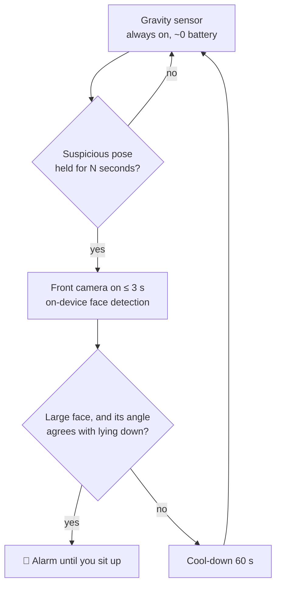
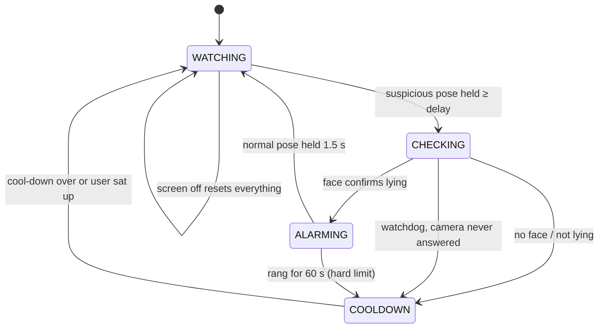

# 🌙 Rebahan Guard

**An Android app that rings an alarm when you use your phone while lying in bed.**

*Rebahan* is Indonesian for "lying around". Scrolling while lying down quietly eats into sleep, so this app catches it with **sensor fusion**: a cheap gravity sensor watches all the time, and the front camera only switches on for a few seconds to confirm.

[](https://github.com/wisnujayaa-labs/rebahan-guard/actions/workflows/build.yml)


---

## Why this is harder than it sounds

A phone has no "bed sensor". GPS can't help either: indoors it is off by 5–20 m, and even a perfect fix can't tell *on the bed* from *on the desk next to it*. So the app answers a different, measurable question:

> **Is the user's head horizontal while the screen is in use?**

## How it works



This **cascade** (cheap detector first, expensive one only on suspicion) is the same idea behind "Hey Google" wake-word chips.

### Step 1 — Are you looking down at the phone, or up at it?

The accelerometer always feels gravity, so the app knows the **screen elevation**: the angle the screen faces, from +90° (ceiling) to −90° (floor).

The key observation came from real-world testing: **sitting, you look *down* at your phone, so the screen faces up. Lying in bed (flat *or* propped up on a pillow, phone held upright), you look straight at it or *up* at it, so the screen faces sideways or down.**

| What you're doing | Screen elevation | Pose |
|---|---|---|
| Sitting, normal use | about +20° … +60° | `UPRIGHT` / `TILTED` |
| Propped on a pillow, phone upright | about −5° … −30° | `FACE_DOWN` (suspicious) |
| Flat on your back, phone overhead | about −60° … −90° | `FACE_DOWN` (suspicious) |
| On your side | phone's long edge points down | `SIDEWAYS` (suspicious) |

The threshold (default −5°) can be **calibrated**: the app records 5 s of sitting and 5 s of lying and picks the angle that best separates the two. This is a tiny one-feature classifier, made robust to stray samples by using percentiles instead of min/max.

### Step 2 — Head orientation = phone orientation + face roll

Gravity alone can't separate every case (e.g. lying on your side with the phone upright, or sitting while watching a landscape video). The camera reports the face's **roll** inside the image, and combining it with the phone's rotation gives the tilt of the *head* relative to Earth:

| Phone (gravity) | Face in image | Head | Verdict |
|---|---|---|---|
| Sideways | upright | sideways | **lying on side** 🔔 |
| Sideways | rotated 90° | upright | sitting, landscape video ✅ |
| Upright *(strict mode)* | rotated 90° | sideways | **lying on side** 🔔 |
| Upright | upright | upright | sitting ✅ |
| Screen facing down | any large face | — | **looking up from below** 🔔 |

The math uses only absolute angles, so it doesn't depend on sign conventions (front-camera mirroring, ML Kit's roll direction). Diagonal holds (≈45°), where the two readings become ambiguous, are deliberately left undecided (fail-safe). A minimum face size (20 % of the image width) means a roommate across the room is ignored.

**Strict mode** (optional) also checks with the camera while the phone is upright. Since sitting up doesn't change an upright phone's pose, alarms in this mode ring in 5-second bursts with a camera re-check in between, and stop as soon as the head is upright again.

### Step 3 — A testable state machine



All decisions live in pure Kotlin (`core/`, zero Android imports), so they are covered by fast JVM unit tests with fake timestamps.

## Architecture

```
app/src/main/java/io/github/wisnujayaa/rebahanguard/
├── core/                 # Pure logic, unit-tested
│   ├── Pose.kt           #   gravity vector → Pose
│   ├── SensorInput.kt    #   input sanitising, lock-screen rule, accelerometer filter
│   ├── Debouncer.kt      #   "true for N ms" filter
│   ├── LyingJudge.kt     #   sensor fusion: pose + face → head tilt → lying?
│   ├── Calibrator.kt     #   learns the personal lying threshold from two recordings
│   ├── AlarmSoundPolicy.kt # validates the chosen alarm sound URI
│   └── GuardEngine.kt    #   state machine, emits Actions
├── service/              # Android glue
│   ├── GuardService.kt   #   foreground service (type=camera), sensors, screen on/off
│   ├── FaceChecker.kt    #   CameraX ImageAnalysis + ML Kit face detection
│   ├── AlarmPlayer.kt    #   looping alarm sound + vibration
│   └── GuardStatusStore.kt # StateFlow shared with the UI
├── ui/Theme.kt           # Material 3, dynamic color
└── MainActivity.kt       # Jetpack Compose screen
```

The engine never touches hardware: it returns an `Action` (`START_CAMERA_CHECK`, `START_ALARM`, …) and the service performs it. This keeps the logic testable and the Android layer thin.

## Security & privacy

| Threat / risk | Mitigation |
|---|---|
| Camera images leaking | Frames analysed in memory and dropped; nothing saved. The manifest **removes `INTERNET`** (which ML Kit's telemetry would add), so the app cannot send anything anywhere. |
| Silent camera use | Camera on only ≤ 4 s per check, only after a suspicious pose, never on the lock screen; Android's green indicator always shows. |
| Other apps controlling the service | Service and screen receiver are **not exported**; notification `PendingIntent`s are explicit and `FLAG_IMMUTABLE`. |
| Malformed input (sensor glitches, NaN/∞, corrupted settings, intent extras, alarm sound URIs) | Everything is validated or clamped at the boundary (`SensorInput`, `FaceObservation.isValid`, `GuardConfig` `require`s). Invalid data is always treated as *not lying*: fail-safe, never a false alarm. |
| App stuck or annoying | Watchdog ends a camera check that never answers; the alarm stops by itself after 60 s; screen-off stops everything. |
| Crash on a background thread | Frame analysis catches every exception; alarm sound and vibration fail independently. |
| Supply chain (CI) | Workflow token is read-only, Gradle wrapper is checksum-validated, Dependabot proposes dependency updates. |
| Native-library crashes on 16 KB-page devices | Uses the *unbundled* ML Kit model; the bundled variant has been [reported](https://github.com/googlesamples/mlkit/issues/1024) to fail on such devices. |

`allowBackup` is off, and the only stored data is the delay setting.

## Testing

All decision logic is pure Kotlin, so it is tested on the JVM in well under a second.

| Suite | What it covers |
|---|---|
| `PoseClassifierTest` | Known poses, NaN/∞/zero/huge readings, 100 000 random vectors checked against the math, scale invariance |
| `LyingJudgeTest` | Sensor fusion rules, head-tilt math, sign-convention independence, diagonal ambiguity, garbage detector output |
| `CalibratorTest`, `AlarmSoundPolicyTest` | Threshold learning (separable, overlapping, impossible, noisy, garbage data), URI allow-list (rejects `file://`, `http(s)://`, control chars, oversized) |
| `SensorInputTest`, `GravityFilterTest` | Malformed events, lock screen, setting clamping, filter priming, glitch recovery |
| `DebouncerTest`, `GuardConfigTest` | Timing, clock going backwards, invalid configuration |
| `GuardEngineTest` | Full cycles plus unexpected situations: camera never answers, late/duplicate results, alarm limit, flickering pose, timestamp overflow, strict-mode bursts and re-checks |
| `GuardEngineFuzzTest` | ~1.2 million random events against a fake phone that tracks the real camera/alarm state, asserting safety invariants after every event (camera never started twice, alarm only after a positive check, every alarm stopped exactly once, nothing stuck), including strict mode and a run where the clock jumps backwards |

**Mutation testing** was used to check that the tests themselves are strong: ten realistic bugs (no watchdog, no alarm limit, trusting NaN faces, lock-screen triggering, cooldown overflow, …) were re-inserted one at a time, and the suite caught **9/10**. The survivor turned out to be an *equivalent mutant*: a redundant NaN check whose removal doesn't change behaviour, because a second check also catches it.

## Android platform constraints (and how they're handled)

| Constraint | Handling |
|---|---|
| Camera is a *while-in-use* permission: a camera foreground service can't be **started** from the background (Android 12+/14+) | Guard is started from the visible app; service declared `foregroundServiceType="camera"` |
| A system restart of the service would happen from the background and fail | `START_NOT_STICKY`; user re-enables from the app |
| Background apps don't receive continuous sensor events | Foreground service keeps sensor access |
| Battery | Sensors unregister when the screen turns off; camera only on suspicion; 60 s cool-down |
| Phones without Google Play services | Face checks fail gracefully (treated as "no face"); the app keeps running |

## Known limitations / roadmap

- [ ] Lying on your stomach (phone face-up) is not detected yet — idea: proximity sensor + pitch angle
- [ ] Very dark rooms can make face detection fail (screen light usually helps)
- [ ] Instrumented (on-device) tests for the service and camera layer
- [ ] Some OEM battery savers (Xiaomi, Oppo, vivo) may kill the service — whitelist the app
- [ ] Schedule (only active at night), statistics of "caught" events
- [ ] Learn the threshold from more than one feature (e.g. add head pitch) — a small logistic regression

## Build & install

**No Android Studio needed.** Every push to `main` runs GitHub Actions, which runs the unit tests and builds the APK:

1. Open the **Actions** tab → latest *Build APK* run → download **RebahanGuard-apk**.
2. Unzip, copy the `.apk` to your phone, open it, allow "Install unknown apps".
3. Open the app → set the delay → **Aktifkan penjaga** → grant camera + notifications.

Local build (needs JDK 17 + Android SDK):

```bash
./gradlew testDebugUnitTest   # unit + fuzz tests
./gradlew lintDebug           # Android lint
./gradlew assembleDebug       # → app/build/outputs/apk/debug/app-debug.apk
```

> `keystore/debug.keystore` is a public debug key (password `android`) committed on purpose so that every CI build installs as an update. It must never be used for a store release.

## Tech stack

Kotlin · Jetpack Compose (Material 3) · CameraX · Google ML Kit Face Detection · Android Sensor framework · Foreground services · StateFlow · JUnit · GitHub Actions

## License

MIT — see [LICENSE](LICENSE).
